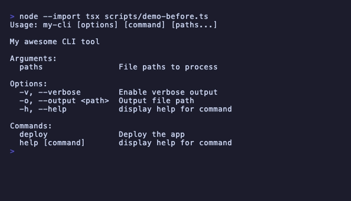
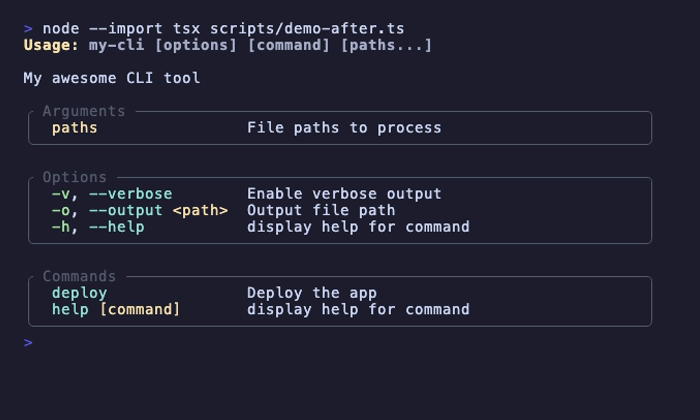

# epaulettes

Styled help for [Commander.js](https://github.com/tj/commander.js) CLIs.

## What it does

Commander.js prints help as flat text. Epaulettes wraps each section (Arguments, Options, Commands)
in box-drawing borders and applies configurable ANSI styles to flags, usage lines, type annotations,
and description text.

<table>
<tr>
<th>Before</th>
<th>After</th>
</tr>
<tr>
<td></td>
<td></td>
</tr>
</table>

When `--no-color` is active, Commander strips ANSI codes while borders remain.

## Installation

```bash
npm install @jeffzi/epaulettes commander
```

Requires **Node.js 22+**. ESM only (no CommonJS). Commander 15+ is a peer dependency.

## Quick example

```typescript
import { Command } from "commander";
import { createHelpConfig } from "@jeffzi/epaulettes";

const program = new Command()
  .name("my-cli")
  .description("My awesome CLI tool")
  .option("-v, --verbose", "Enable verbose output")
  .option("-o, --output <path>", "Output file path")
  .configureHelp(createHelpConfig());

program.parse();
```

## Customization

Pass an options object to override defaults:

```typescript
import { createHelpConfig } from "@jeffzi/epaulettes";

const helpConfig = createHelpConfig({
  accentStyle: "green",
  titleStyle: "red",
  borderColor: "blue",
  borderStyle: "double",
});

program.configureHelp(helpConfig);
```

### Options

| Property              | Type          | Default              | Description                                                                                          |
| --------------------- | ------------- | -------------------- | ---------------------------------------------------------------------------------------------------- |
| `accentStyle`         | `StyleSpec`   | `"cyan"`             | ANSI style for the text after each option flag, subcommand name, or argument name                    |
| `titleStyle`          | `StyleSpec`   | `["yellow", "bold"]` | ANSI style for the "Usage:" prefix                                                                   |
| `shortFlagStyle`      | `StyleSpec`   | `"green"`            | ANSI style for short flags (`-v`, `-h`)                                                              |
| `longFlagStyle`       | `StyleSpec`   | `"cyan"`             | ANSI style for long flags (`--verbose`, `--help`)                                                    |
| `typeAnnotationStyle` | `StyleSpec`   | `"yellow"`           | ANSI style for type annotations (`<path>`, `[value]`) and argument descriptions                      |
| `usageStyle`          | `StyleSpec`   | `["white", "bold"]`  | ANSI style for the usage line content (after "Usage:")                                               |
| `borderColor`         | `BorderColor` | `"gray"`             | Border color — named ANSI colors with autocomplete, or any string                                    |
| `borderStyle`         | `BorderStyle` | `"round"`            | Box-drawing style name or `{ topLeft, top, topRight, right, bottomRight, bottom, bottomLeft, left }` |

**`Style`** — re-export of `node:util`'s `InspectColor`: all ANSI modifiers (`"bold"`, `"dim"`,
`"italic"`, `"underline"`, …), foreground colors (`"red"`, `"green"`, `"cyan"`, …), and background
colors (`"bgRed"`, `"bgGreen"`, …)

**`StyleSpec`** — a single `Style` or an array of styles for compound formatting (e.g.
`["white", "bold"]`)

**`BorderColor`** — `"black"` | `"red"` | `"green"` | `"yellow"` | `"blue"` | `"magenta"` |
`"cyan"` | `"white"` | `"gray"` | `"grey"` | `"blackBright"` | `"redBright"` | `"greenBright"` |
`"yellowBright"` | `"blueBright"` | `"magentaBright"` | `"cyanBright"` | `"whiteBright"` | or any
string

**`BorderStyle`** — `"round"` | `"single"` | `"double"` | `"bold"` | `"singleDouble"` |
`"doubleSingle"` | `"classic"` | `"arrow"` | `"none"` | or a `{ topLeft, top, topRight, right,
bottomRight, bottom, bottomLeft, left }` object with single-character strings

## License

[MIT](LICENSE)
